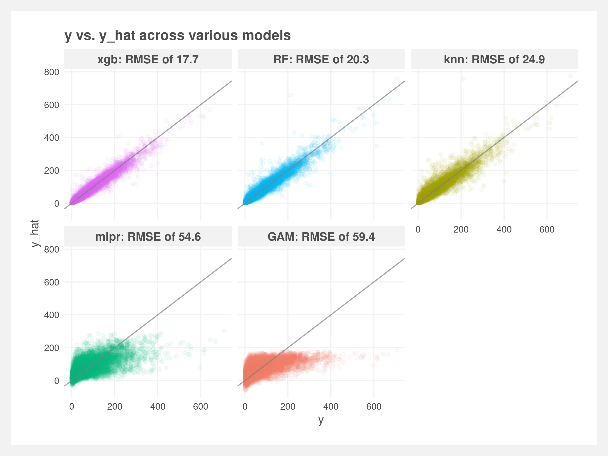

# Citi-Bike-prediction

Prediction evaluation of daily rides starting from each Citi Bike station. Trained and tested on a 80/20 split of 1.4 million observations representing 95 million bike trips from 2013 to early 2020.

See also [NYC-data](https://github.com/joemarlo/NYC-data)

 

 

Variables used:
- Distance to closest subway station
- Year
- Month of year
- Workday or not (weekdays minus holidays)
- Precipitation
- Max and minimum temperature
- Max wind speed

Data sources:
- https://www.citibikenyc.com/system-data
- https://data.ny.gov/widgets/i9wp-a4ja
- https://www.ncdc.noaa.gov/cdo-web/search
